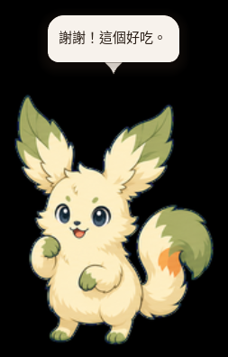
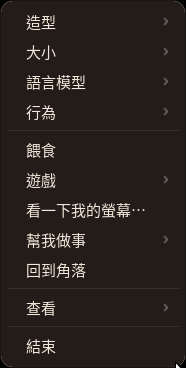
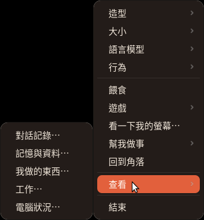
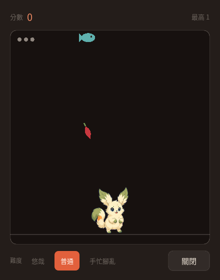
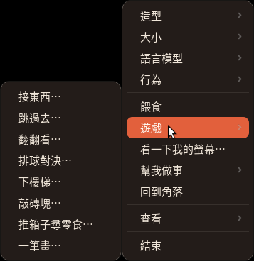

# Godot Pet

<p align="center">
  
</p>

一隻住在桌面角落的桌寵。透明、無邊框、永遠在最上層，點牠以外的地方會直接穿透到後面的
視窗。牠會自己走動、發呆、肚子餓，也可以跟你聊天 —— 對話走 OpenAI 的串流 API，情緒由
模型自己標，動畫跟著情緒換。

牠同時也是一個小助手，但不是靠自己變成 agent，而是當一個 agent 的**臉**：你跟牠說要做
什麼，牠把工作交給你機器上的 `claude` 或 `codex`，在你明確授權過的資料夾裡跑，然後回來
跟你講結果。

用 Godot 4.7 + GDScript 寫的個人專案。

> 截圖裡的角色是專案自己的「芽尾」。社群造型不會出現在這個 repo 裡，也不會出現在截圖裡
> —— 見下面「造型素材」。

## 怎麼用

右鍵點牠就是全部的入口。四個設定子選單、五個動詞、一扇通往所有視窗的門：

<p align="center">
  
  &nbsp;&nbsp;
  
</p>

左鍵可以拖著牠走（身體會拖在游標後面一點，放手才慢慢跟上來），點一下會彈一下，
把檔案拖到牠身上會被讀進對話。要打字就點牠一下叫出輸入框，Enter 送出、Shift+Enter 換行。

## 造型素材

專案內建一份原創的「芽尾」[Codex Pets](https://codex-pets.net/) / petdex v2
sprite pack，沒有安裝或選擇其他造型時就會使用它。11 列圖集包含待機、左右移動、揮手、
跳躍、失敗、等待、工作、檢查，以及會追著游標看的 16 個方向。

社群造型仍然不會放進這個 repo。格式與工具是 MIT，但社群素材不是 —— 原創作品預設
CC BY-NC-SA，第三方角色的同人只允許個人非商業使用。程式只從你自己的安裝位置讀取，
授權關係就留在你跟素材作者之間，不會因為經過這個 repo 而被重新散布。

## 需求

- **Godot 4.7**（開發與驗證都在 4.7.1 stable）。從 [godotengine.org](https://godotengine.org/)
  下載即可，不需要 .NET 版
- 想真的聊天的話要一支 **OpenAI API key**。沒有 key 也跑得動，會退到 mock provider 講罐頭台詞
- 想用「幫我做事」的話，要有 `claude` 或 `codex` CLI 而且已經登入
- Linux 額外需要 `libsecret-tools`（憑證儲存）與 `speech-dispatcher`（語音，Ubuntu 桌面預設就有）
- 想讓牠用**本機神經網路語音**（甚至用你自己的聲音）講話的話，要有編好的
  [qwen3-tts.cpp](https://github.com/predict-woo/qwen3-tts.cpp) 與它的模型，外加 `python3`。沒有的話這個選項會
  灰掉並在提示裡說少了什麼，其餘一切照舊 —— 什麼都不會壞

## 跑起來

```sh
godot --path .                       # 直接跑
godot --headless --import --path .   # 匯入素材 + 檢查所有腳本能不能 parse
```

第二行是這個專案唯一的靜態檢查（**沒有測試**），改完腳本一定要跑，並且在輸出裡 grep
`SCRIPT ERROR|Parse Error|Failed to load`。它抓不到全部 —— 有些錯誤要到腳本第一次被載入才
會浮出來，所以執行時的 log 也要看。

打包：

```sh
godot --headless --path . --export-release "macOS"   "build/Godot Pet.app"
godot --headless --path . --export-release "Windows" "build/windows/Godot Pet.exe"
godot --headless --path . --export-release "Linux"   "build/linux/GodotPet.x86_64"
```

三個 preset 都能從任一平台交叉匯出。匯出需要對應版本的 export templates，而且
`rendering/textures/vram_compression/import_etc2_astc` 必須保持開啟，否則 arm64／universal
build 會直接被拒絕。

## 圖示會跟著你選的寵物

換寵物的時候，app 自己的圖示也會換成那一隻的站姿 —— 從 pack 的待機列切下來，不用匯出、
不用跑腳本。這件事在三個平台上是三種機制：

| 平台 | 做法 |
|---|---|
| Linux（GNOME） | 跑一次 `tools/install_linux_desktop_entry.sh` |
| Linux（其他 WM）／Windows | 自動，程式直接設定視窗圖示 |
| macOS | 匯出後跑 `tools/make_app_icon.sh` |

GNOME 需要多這一步，因為 **mutter 已經不讀 `_NET_WM_ICON` 了**：屬性設得好好的，dash 照樣
畫預設的齒輪。那支腳本裝一個 `.desktop`，用 `StartupWMClass` 讓視窗比對上它，`Icon=` 指向
程式自己會重寫的 PNG —— 裝一次，之後圖示就自己跟著寵物走。已經在跑的話要重開一次，
GNOME 只在視窗出現時比對一次。

## 設定 API key

右鍵選單 →「語言模型」→「更換 OpenAI API key」，貼上按 Enter。key 會進作業系統的憑證庫：

| 平台 | 後端 |
|---|---|
| macOS | Keychain（`security`） |
| Linux | libsecret / GNOME Keyring（`secret-tool`，需 `apt install libsecret-tools`） |
| Windows | DPAPI（`ConvertFrom-SecureString`，密文放 `user://secrets/`） |
| 其他 | 退回明文設定檔，而且 UI 會**照實說出來** |

`Config.get_secret()` 的查找順序是：環境變數 → 憑證庫 → 執行檔／專案旁的 `.env` →
`config.cfg`。

同一個「語言模型」選單會標示目前的模型與推理程度；按「更換模型與推理程度…」會開啟獨立設定視窗。預設是
`gpt-5.6-luna`＋`none`；視窗會顯示從 `none` 到 `max` 的全部選項，模型不支援的等級會停用，
避免送出無效組合。等級越高通常越慢、也會使用更多 token；視窗下方會提示所選等級的取捨。

**打包出來的 build 讀不到 `res://.env`**，所以一台從原始碼跑得好好的機器，打包後會突然掉回
mock。key 要從選單設定，那條路兩邊都讀得到。

## 造型

```sh
npx codex-pets add <pet-id>
```

裝到 `~/.codex/pets/{id}/`，重開寵物後右鍵選單「造型」就會出現。格式的坑不少（列數不固定、
幀數與列語意都沒宣告），細節在 CLAUDE.md。選單裡有「校準動畫列」可以逐列播放給人眼確認，
對不上的話可以用 `config.cfg` 的 `[pet_rows]` 區段逐隻覆寫，不用改程式。

不同 pack 的角色在 cell 裡佔的比例差很多（實測 76%～95%），所以繪製時會先正規化到一致的
身高，你選的大小再乘上去。

`spriteVersionNumber: 2` 的 11 列造型會使用各自的左右移動列；如果第 9、10 列含完整的
16 方位視線，待機時還會隨游標方向切換頭部與視線，不再只做整隻水平翻轉。

## 功能

- **對話** —— OpenAI 串流。回覆開頭的 `[happy]` 之類的情緒標記決定講話時播哪個動畫，標記
  在進到對話框和歷史之前就被剝掉
- **記憶** —— 三層：近期逐字、較舊的摘要、關於你的長期事實。有一個視窗可以看牠記得什麼，
  每一條都能單獨刪掉。清掉對話不會清掉「你是誰」，那是另一個按鈕
- **需求** —— 飽足、精力、心情、好感。心情不是獨立的，會朝著由飽足與精力算出來的目標漂移，
  所以又餓又累的寵物自然就會擺臭臉。關掉 app 的時間算牠在睡覺，上限一天
- **主動搭話** —— 台詞來自 `prompts/nudges.json`，**不呼叫 LLM**。閒著的寵物每幾分鐘打一次
  API 是純燒錢，而讓搭話有生命感的是時機不是措辭
- **看螢幕** —— 要你同意才會截圖。可以從選單叫，也可以直接問牠「看一下我在幹嘛」
- **拖檔案給牠** —— 把檔案拖到寵物身上，牠會讀完跟你聊。看起來裝密鑰的檔案（`.env`、`.pem`
  之類）會在讀取任何位元組之前就被擋掉
- **依你的節奏搭話** —— 要你同意後，牠會知道你在哪個 app 待了多久（**只有 app 名稱，永遠不碰
  視窗標題**），久坐不動會來叫你休息
- **看電腦在忙什麼** —— 每 20 分鐘掃一次 process，記憶體快沒了或某支程式吃太兇才會開口，
  其餘都留在「電腦狀況」那個視窗裡。**預設關閉**，資料不離開這台機器
- **我做的東西** —— 牠產出的檔案都放在 `~/文件/GodotPet`（刻意不放 `user://`，埋在
  `~/.local/share` 底下就違背了「你找得到、打得開」這件事）。目前唯一的產出是對話記錄匯出，
  那個完全不需要 LLM
- **語音** —— 句子邊串流邊念。系統內建語音（`DisplayServer.tts_speak()`）不需 API；預設的
  VoxCPM 神經網路語音服務位於 `https://voice.anfucwbot.uk`，需在「說話 → 進階設定」填入
  VoxCPM API key，語音文字會送到該服務生成音訊。也可以把服務位置改回自己架設的 VoxCPM。
  用「錄一段話」存下來的聲音可在「我做的東西」設成角色；聲音可以存好幾個，要換時到
  「說話」→「更換角色…」選擇

### 遊戲

八個，共用一個視窗、三種難度、各自記最高分：接東西、跳過去、翻翻看、排球對決、下樓梯、
敲磚塊、推箱子尋零食、一筆畫。

<p align="center">
  
  &nbsp;&nbsp;
  
</p>

不是三個同類的反射遊戲換三套皮：接東西考「往哪」、跳過去考「什麼時候」、翻翻看考記性，
其餘各有各的動詞。桌寵是你思考時會看一眼的東西，不是要你全神貫注的。

接到食物會加一點飽足，但**上限壓得很低**（遠低於一次餵食）。不設限的話「玩到牠不餓」會
悄悄取代餵食，而且是更糟的循環。其他遊戲完全不加。

### 幫我做事

牠的工作不是當 agent，而是當 agent 的臉。你說要做什麼，牠交給 `claude` 或 `codex`，
然後回來報告 —— 對話框塞滿 tool call 的東西就不再是寵物了，所以對話框只講一句，
其餘都在「工作」那個視窗裡。

- **資料夾要你一個一個加，永遠不會被推測出來。** 拒絕檔案系統根目錄、家目錄本身，以及
  任何含隱藏路徑的位置（一條規則就同時擋掉 `~/.ssh`、`~/.gnupg`、`~/.config`、`~/.codex`、
  `~/.claude`，以及所有未來會出現的）
- 每個資料夾兩種層級：`read` 與 `edit`。**沒有更高的層級**，「而且可以碰資料夾外面」不在選項裡
- 兩種進入方式：選單走「幫我做事 → 資料夾 → 打字」，或者直接在聊天裡說。後者由模型自己
  判斷要用哪個資料夾，但**不會直接開跑** —— 這會花錢也會改檔案，所以會先把牠的判斷攤給你看
- 「改了什麼」是去問 git，不是聽 agent 自己說
- 可編輯的 git 資料夾裡有沒存的東西時，**每次**開工前都會問一次
- 後續追問會接上同一個 session（每個資料夾各自一條），所以「不對，再改一下」不用重讀整個專案

`claude` 與 `codex` 不對等，這點值得先知道：codex 有 OS 層級的沙箱（`workspace-write`），
claude 沒有，它跑的 shell 指令能碰到你能碰的任何地方。同意的對話框就是這樣寫的，不會
假裝有一個並不存在的圍籬。

## 隱私

這個專案的預設是「不問就不拿」：

- 螢幕**只有**你按下同意才會截取，而且不會定時跑、不會從主動搭話觸發。看螢幕得到的回覆會標成
  ephemeral —— 留在近期對話裡讓你能追問，但不會被摘要、不會變成長期事實、不會寫進 `memory.json`
- 前景 app 的偵測同樣要同意，而且只取 app 名稱
- process 的掃描預設關閉，只在本機讀取，不送去任何地方。但**牠講出口的那句話會進對話**，
  模型下一輪看得到 —— 否則你回一句「哪個程式在吃？」，牠會完全不知道自己剛說了什麼
- 工作資料夾要你逐一授權，而且不會從你的檔案系統推測任何東西
- API key 走憑證庫，傳給子行程時盡量走 stdin 而不是 argv（`ps` 對同一個使用者是全都看得到的）
- 執行時的資料全部在 `user://`，不在 repo 裡：`config.cfg`、`state.json`、`memory.json`

## 不用改程式就能調的東西

| 檔案 | 調什麼 |
|---|---|
| `prompts/persona.md` | 角色人設與回覆格式 |
| `prompts/nudges.json` | 主動搭話的台詞池（`hungry` / `tired` / `lonely` / `focus` / `cheerful` / `memory`） |
| `autoload/pet_state.gd` 的 `DECAY` / `STARTING` | 需求衰減速度與初始值 |
| `config.cfg` 的 `[pet_rows]` | 每隻寵物的動畫列對應 |
| `config.cfg` 的 `[monitor]` | 掃描的工作時段與三個警戒門檻 |

門檻放在設定檔而不是程式裡，因為「多少算太多」是機器的性質：8 GB 的 12% 跟 64 GB 的 12%
不是同一種麻煩。prompt 檔案要重開才生效。

## 平台狀態

老實說，因為「匯出成功」跟「跑得起來」是兩件事：

| 平台 | 狀態 |
|---|---|
| macOS | 開發機。Phase 10 之前的東西都在這裡驗過，之後加的（游標反應、拖檔案、記憶搭話、節奏感知）還沒回歸 |
| Linux（Ubuntu 24.04 / GNOME on X11） | **從原始碼**跑過，包含遊戲、工作、圖示。GNOME 的 mutter 不讓視窗超出工作區，那是繞過去了（見 CLAUDE.md）；匯出的 build 仍然沒跑過 |
| Linux（Wayland） | 沒支援。Wayland 不讓 client 自己決定視窗位置，而那正是這隻寵物在做的事 |
| Windows | Win11／GTX 1650 跑過第一版；Vulkan 冷啟動會間歇崩潰，且透明視窗定位有誤。現在改走 OpenGL Compatibility、把視窗限制在工作區內；修正版仍待同一台機器回歸 |

「幫我做事」與前景 app 偵測在 Windows 上都回報不支援，不是忘了做：前者的啟動器是
`/bin/sh`，後者要在每一次計時器觸發時付一次 PowerShell 啟動的代價。選單裡是灰掉而不是藏起來。

macOS 要開螢幕錄製權限，而且**失敗是無聲的** —— 沒給權限的話截到的只有桌布跟自己的視窗，
不會報錯。每一個匯出的 binary 都要各自授權一次。

## 文件

- **`PLAN.md`** —— 活的設計文件。分階段里程碑、每個決定當初為什麼那樣選、以及一路上撞到的
  平台怪癖。想知道「為什麼是這樣」看這裡
- **`CLAUDE.md`** —— 架構說明，寫給要改這份程式碼的人（含 AI）。密度很高，而且幾乎每一段都
  是先講什麼壞掉了才講程式怎麼寫

## 授權

程式碼還沒有宣告授權。

美術方面：內建的「芽尾」是專案自己的，截圖裡也只有牠。社群 pack 從來不在這個 repo 裡，
程式只從你自己的安裝位置讀，授權關係留在 pack 作者與你之間 —— 見上面「造型素材」。
